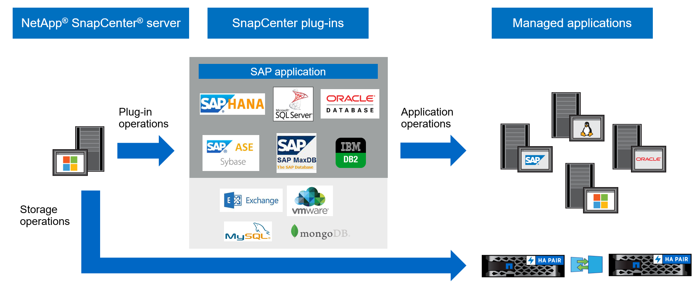

= Panoramica SnapCenter
:allow-uri-read: 
:icons: font
:imagesdir: ../media/

[role="lead"]
Il SnapCenter software è una piattaforma semplice, centralizzata e scalabile per la protezione dei dati coerente con le applicazioni. Protegge applicazioni, database, file system host e VM sui sistemi ONTAP nel cloud ibrido.

SnapCenter utilizza le tecnologie NetApp Snapshot, SnapRestore, FlexClone, SnapMirror e SnapVault per fornire:

* Backup basati su disco rapidi, efficienti in termini di spazio e coerenti con le applicazioni
* Ripristino rapido e dettagliato e recupero coerente con l'applicazione
* Clonazione rapida e salvaspazio

SnapCenter include SnapCenter Server e plug-in leggeri. È possibile automatizzare la distribuzione dei plug-in su host di applicazioni remote, pianificare operazioni di backup, verifica e clonazione e monitorare le operazioni di protezione dei dati.

Per proteggere i dati, puoi installare SnapCenter in locale o su un cloud pubblico.

* In sede per proteggere quanto segue:
+
** Dati presenti sui sistemi primari ONTAP FAS, AFF o ASA e replicati sui sistemi secondari ONTAP FAS, AFF o ASA
** Dati presenti sui sistemi primari ONTAP Select
** Dati presenti sui sistemi primari e secondari ONTAP FAS, AFF o ASA e protetti nell'archiviazione di oggetti StorageGRID locale
** Dati presenti sui sistemi primari e secondari ONTAP ASA r2

* In locale in un cloud ibrido per proteggere quanto segue:
+
** Dati presenti sui sistemi primari ONTAP FAS, AFF o ASA e replicati su Cloud Volumes ONTAP
** Dati presenti sui sistemi primari e secondari ONTAP FAS, AFF o ASA e protetti su storage di oggetti e archivi nel cloud tramite l'integrazione di backup e ripristino NetApp

* In un cloud pubblico per proteggere quanto segue:
+
** Dati presenti sui sistemi primari Cloud Volumes ONTAP (in precedenza ONTAP Cloud)
** Dati presenti su Amazon FSX per ONTAP
** Dati presenti nei Azure NetApp Files primari (Oracle, Microsoft SQL e SAP HANA)

== Caratteristiche principali

SnapCenter offre le seguenti funzionalità principali:

* Protezione dei dati centralizzata e coerente con le applicazioni di diverse applicazioni
+
La protezione dei dati è supportata per Microsoft Exchange Server, Microsoft SQL Server, Oracle Database su Linux o AIX, database SAP HANA, IBM Db2, PostgreSQL, MySQL e file system host Windows in esecuzione su sistemi ONTAP .  SnapCenter supporta anche la protezione di applicazioni quali MongoDB, Storage, MaxDB, Sybase ASE, ORASCPM.

* Backup basati su policy
+
I backup basati su policy sfruttano la tecnologia NetApp Snapshot per creare backup basati su disco rapidi, efficienti in termini di spazio e coerenti con le applicazioni. È anche possibile impostare la protezione automatica di questi backup su un archivio secondario aggiornando le relazioni di protezione esistenti.

* Backup per più risorse
+
È possibile eseguire il backup di più risorse (applicazioni, database o file system host) dello stesso tipo contemporaneamente utilizzando i gruppi di risorse SnapCenter .

* Ripristino e recupero
+
SnapCenter fornisce ripristini rapidi e granulari dei backup e ripristini basati sul tempo e coerenti con l'applicazione.  È possibile effettuare il ripristino da qualsiasi destinazione nel cloud ibrido.

* Clonazione
+
SnapCenter consente una clonazione rapida, efficiente in termini di spazio e coerente con l'applicazione. È possibile clonare su qualsiasi destinazione nel cloud ibrido.

* Interfaccia utente grafica per la gestione di un singolo utente
+
SnapCenter fornisce un'unica interfaccia per gestire backup e cloni in qualsiasi destinazione Hybrid Cloud.

* API REST, cmdlet di Windows, comandi UNIX
+
SnapCenter fornisce API REST per la maggior parte delle funzionalità per l'integrazione con qualsiasi software di orchestrazione e l'uso di cmdlet di Windows PowerShell e interfaccia della riga di comando.

* Dashboard e reporting centralizzati sulla protezione dei dati
* Controllo degli accessi basato sui ruoli (RBAC) per la sicurezza e la delega
* Un database di repository integrato con elevata disponibilità per archiviare tutti i metadati di backup
* Installazione push automatizzata dei plug-in
* Alta disponibilità
* Ripristino di emergenza (DR)
* SnapLock https://docs.netapp.com/us-en/ontap/snaplock/["Saperne di più"]
* Sincronizzazione attiva SnapMirror (inizialmente rilasciata come SnapMirror Business Continuity [SM-BC])
* Mirroring sincrono https://docs.netapp.com/us-en/e-series-santricity/sm-mirroring/overview-mirroring-sync.html["Saperne di più"]

== Architettura e componenti SnapCenter

SnapCenter utilizza un design a strati con un server di gestione centrale e host plug-in. Il server e gli host dei plug-in possono trovarsi in posizioni diverse.

SnapCenter include SnapCenter Server, il pacchetto SnapCenter Plug-in per Windows e il pacchetto SnapCenter Plug-in per Linux.  Ogni pacchetto contiene plug-in per varie applicazioni e componenti infrastrutturali.

=== Server SnapCenter

SnapCenter Server supporta i sistemi operativi Microsoft Windows e Linux (RHEL 8.x, RHEL 9.x, SLES 15 SP5).  Il server SnapCenter include un server Web, un'interfaccia utente centralizzata basata su HTML5, cmdlet PowerShell, API REST e il repository SnapCenter .

SnapCenter memorizza le informazioni sulle sue operazioni nel repository SnapCenter .

=== Plug-in SnapCenter

Ogni plug-in SnapCenter supporta ambienti, database e applicazioni specifici.

|===
| Nome del plug-in | Incluso nel pacchetto di installazione | Richiede altri plug-in | Installato sull'host | Piattaforma supportata 

 a| 
Plug-in SnapCenter per Microsoft SQL Server
 a| 
Pacchetto di plug-in per Windows
 a| 
Plug-in per Windows
 a| 
Host di SQL Server
 a| 
Finestre

 a| 
Plug-in SnapCenter per Windows
 a| 
Pacchetto di plug-in per Windows
 a| 
 a| 
Host Windows
 a| 
Finestre

 a| 
Plug-in SnapCenter per Microsoft Exchange Server
 a| 
Pacchetto di plug-in per Windows
 a| 
Plug-in per Windows
 a| 
Host del server Exchange
 a| 
Finestre

 a| 
Plug-in SnapCentre per Oracle Database
 a| 
Pacchetto di plug-in per Linux e pacchetto di plug-in per AIX
 a| 
Plug-in per UNIX
 a| 
Host Oracle
 a| 
Linux o AIX

 a| 
Plug-in SnapCenter per il database SAP HANA
 a| 
Pacchetto di plug-in per Linux e pacchetto di plug-in per Windows
 a| 
Plug-in per UNIX o plug-in per Windows
 a| 
Host client HDBSQL
 a| 
Linux o Windows

 a| 
Plug-in SnapCenter per IBM Db2
 a| 
Pacchetto di plug-in per Linux e pacchetto di plug-in per Windows
 a| 
Plug-in per UNIX o plug-in per Windows
 a| 
Host DB2
 a| 
Linux, AIX o Windows

 a| 
Plug-in SnapCenter per PostgreSQL
 a| 
Pacchetto di plug-in per Linux e pacchetto di plug-in per Windows
 a| 
Plug-in per UNIX o plug-in per Windows
 a| 
Host PostgreSQL
 a| 
Linux o Windows

 a| 
Plug-in SnaoCenter per MySQL
 a| 
Pacchetto di plug-in per Linux e pacchetto di plug-in per Windows
 a| 
Plug-in per UNIX o Plug-in per Windows
 a| 
Host MySQL
 a| 
Linux o Windows

 a| 
Plug-in SnapCenter per MongoDB
 a| 
Pacchetto di plug-in per Linux e pacchetto di plug-in per Windows
 a| 
Plug-in per UNIX o plug-in per Windows
 a| 
Host MongoDB
 a| 
Linux o Windows

 a| 
Plug-in SnapCenter per ORASCPM (Oracle Applications)
 a| 
Pacchetto di plug-in per Linux e pacchetto di plug-in per Windows
 a| 
Plug-in per UNIX o plug-in per Windows
 a| 
Host Oracle
 a| 
Linux o Windows

 a| 
Plug-in SnapCenter per SAP ASE
 a| 
Pacchetto di plug-in per Linux e pacchetto di plug-in per Windows
 a| 
Plug-in per UNIX o plug-in per Windows
 a| 
Host SAP
 a| 
Linux o Windows

 a| 
Plug-in SnapCenter per SAP MaxDB
 a| 
Pacchetto di plug-in per Linux e pacchetto di plug-in per Windows
 a| 
Plug-in per UNIX o plug-in per Windows
 a| 
Host SAP MaxDB
 a| 
Linux o Windows

 a| 
Plug-in SnapCenter per il plug-in di archiviazione
 a| 
Pacchetto di plug-in per Linux e pacchetto di plug-in per Windows
 a| 
Plug-in per UNIX o plug-in per Windows
 a| 
Host di archiviazione
 a| 
Linux o Windows

|===
Il SnapCenter Plug-in for VMware vSphere supporta operazioni di backup e ripristino coerenti con gli arresti anomali e con le VM per macchine virtuali (VM), datastore e dischi di macchine virtuali (VMDK). Supporta inoltre operazioni di backup e ripristino coerenti con l'applicazione per database e file system virtualizzati.

Per proteggere database, file system, VM o datastore su VM, distribuire il SnapCenter Plug-in for VMware vSphere . Per informazioni, fare riferimento https://docs.netapp.com/us-en/sc-plugin-vmware-vsphere/index.html["Documentazione SnapCenter Plug-in for VMware vSphere"^] .

=== Repository SnapCenter

Il repository SnapCenter , a volte denominato database NSM, memorizza informazioni e metadati per ogni operazione SnapCenter .

L'installazione SnapCenter Server installa per impostazione predefinita il database del repository MySQL Server. Se hai già installato MySQL Server e vuoi eseguire una nuova installazione di SnapCenter Server, devi disinstallare MySQL Server.

SnapCenter supporta MySQL Server 8.0.37 o versioni successive come database del repository SnapCenter . Se si utilizza una versione precedente di MySQL Server con una release precedente di SnapCenter, il processo di aggiornamento di SnapCenter aggiorna MySQL Server alla versione 8.0.37 o successiva.

Il repository SnapCenter memorizza le seguenti informazioni e metadati:

* Metadati di backup, clonazione, ripristino e verifica
* Informazioni su report, lavori ed eventi
* Informazioni sull'host e sul plug-in
* Dettagli su ruolo, utente e autorizzazione
* Informazioni sulla connessione del sistema di archiviazione

