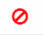

= Aggiungi licenze basate sul controller SnapCenter Standard
:allow-uri-read: 
:icons: font
:imagesdir: ../media/

[role="lead"]
Se si utilizzano controller di archiviazione FAS, AFF o ASA , è necessaria una licenza basata sul controller SnapCenter Standard.

La licenza basata sul controller presenta le seguenti caratteristiche:

* Diritto a SnapCenter Standard incluso con l'acquisto di Premium o Flash Bundle (non con il pacchetto base)
* Utilizzo illimitato dello spazio di archiviazione
* Aggiunto direttamente al controller di archiviazione FAS, AFF o ASA tramite ONTAP System Manager o ONTAP CLI.
+

NOTE: Per le licenze basate sul controller SnapCenter non è necessario immettere alcuna informazione sulla licenza nell'interfaccia utente SnapCenter .

* Bloccato sul numero di serie del controller

Per informazioni sulle licenze richieste, vederelink:../get-started/concept_snapcenter_licenses.html["Licenze SnapCenter"] .

== Passaggio 1: verificare se la licenza di SnapManager Suite è installata

È possibile utilizzare l'interfaccia utente SnapCenter per verificare se una licenza SnapManager Suite è installata sui sistemi di archiviazione primari FAS, AFF o ASA e identificare quali sistemi necessitano di licenze. Le licenze di SnapManager Suite si applicano solo a SVM o cluster FAS, AFF e ASA su sistemi di storage primari.

NOTE: Se sul controller è già presente una licenza SnapManager Suite, SnapCenter fornisce automaticamente il diritto alla licenza Standard basata sul controller. I nomi licenza SnapManagerSuite e licenza basata su controller SnapCenter Standard vengono utilizzati in modo intercambiabile, ma si riferiscono alla stessa licenza.

.Passi
. Nel riquadro di navigazione a sinistra, seleziona *Sistemi di archiviazione*.
. Nella pagina Sistemi di archiviazione, dal menu a discesa *Tipo*, seleziona se visualizzare tutti gli SVM o i cluster aggiunti:
+
** Per visualizzare tutti gli SVM aggiunti, selezionare * ONTAP SVM*.
** Per visualizzare tutti i cluster aggiunti, selezionare *Cluster ONTAP *.
+
Quando si seleziona il nome del cluster, tutte le SVM che ne fanno parte vengono visualizzate nella sezione Macchine virtuali di archiviazione.

. Nell'elenco Connessioni di archiviazione, individuare la colonna Licenza controller.
+
La colonna Licenza controller visualizza il seguente stato:

+
** image:../media/controller_licensed_icon.gif["Un'icona di controllo"]indica che una licenza SnapManager Suite è installata su un sistema di archiviazione primario FAS, AFF o ASA .
** indica che una licenza SnapManager Suite non è installata su un sistema di archiviazione primario FAS, AFF o ASA .
** Non applicabile indica che una licenza SnapManager Suite non è applicabile perché il controller di storage si trova su Amazon FSx for NetApp ONTAP, Cloud Volumes ONTAP, ONTAP Select o piattaforme di storage secondarie.

== Passaggio 2: identificare le licenze installate sul controller

È possibile utilizzare la riga di comando ONTAP per visualizzare tutte le licenze installate sul controller.  Dovresti essere un amministratore del cluster sul sistema FAS, AFF o ASA .

NOTE: Il controller visualizza la licenza basata sul controller SnapCenter Standard come licenza SnapManagerSuite.

.Passi
. Accedere al controller NetApp tramite la riga di comando ONTAP .
. Immettere il comando license show, quindi visualizzare l'output per verificare se la licenza SnapManagerSuite è installata.
+
.Esempio di output
[%collapsible]
====
[listing]
----
cluster1::> license show
(system license show)

Serial Number: 1-80-0000xx
Owner: cluster1
Package           Type     Description              Expiration
----------------- -------- ---------------------    ---------------
Base              site     Cluster Base License     -

Serial Number: 1-81-000000000000000000000000xx
Owner: cluster1-01
Package           Type     Description              Expiration
----------------- -------- ---------------------    ---------------
NFS               license  NFS License              -
CIFS              license  CIFS License             -
iSCSI             license  iSCSI License            -
FCP               license  FCP License              -
SnapRestore       license  SnapRestore License      -
SnapMirror        license  SnapMirror License       -
FlexClone         license  FlexClone License        -
SnapVault         license  SnapVault License        -
SnapManagerSuite  license  SnapManagerSuite License -
----
====
+
Nell'esempio, è installata la licenza SnapManagerSuite, pertanto non è richiesta alcuna ulteriore azione di licenza SnapCenter .

== Passaggio 3: recuperare il numero di serie del controller

Ottenere il numero di serie del controller utilizzando la riga di comando ONTAP . Per ottenere il numero di serie della licenza basata sul controller, è necessario essere un amministratore del cluster sul sistema FAS, AFF o ASA .

.Passi
. Accedere al controller tramite la riga di comando ONTAP .
. Immettere il comando system show -instance, quindi rivedere l'output per individuare il numero di serie del controller.
+
.Esempio di output
[%collapsible]
====
[listing]
----
cluster1::> system show -instance

Node: fasxxxx-xx-xx-xx
Owner:
Location: RTP 1.5
Model: FAS8080
Serial Number: 123451234511
Asset Tag: -
Uptime: 143 days 23:46
NVRAM System ID: xxxxxxxxx
System ID: xxxxxxxxxx
Vendor: NetApp
Health: true
Eligibility: true
Differentiated Services: false
All-Flash Optimized: false

Node: fas8080-41-42-02
Owner:
Location: RTP 1.5
Model: FAS8080
Serial Number: 123451234512
Asset Tag: -
Uptime: 144 days 00:08
NVRAM System ID: xxxxxxxxx
System ID: xxxxxxxxxx
Vendor: NetApp
Health: true
Eligibility: true
Differentiated Services: false
All-Flash Optimized: false
2 entries were displayed.
----
====
. Annotare i numeri di serie.

== Passaggio 4: recuperare il numero di serie della licenza basata sul controller

Se si utilizza un archivio FAS, ASA o AFF , è possibile recuperare la licenza basata sul controller SnapCenter dal sito di supporto NetApp prima di installarla utilizzando la riga di comando ONTAP .

.Prima di iniziare
* È necessario disporre di credenziali di accesso valide al sito di supporto NetApp .
+
Se non inserisci credenziali valide, il sistema non restituirà alcuna informazione per la tua ricerca.

* Dovresti avere il numero di serie del controller.

.Passi
. Accedi al http://mysupport.netapp.com/["Sito di supporto NetApp"^] .
. Vai a *Sistemi* > *Licenze software*.
. Nell'area Criteri di selezione, assicurati che sia selezionato Numero di serie (situato sul retro dell'unità), inserisci il numero di serie del controller e seleziona *Vai!*.
+
image::../media/nss_controller_license_select.gif[Screenshot dei criteri di selezione e dell'inserimento del numero di serie.]

+
Viene visualizzato un elenco delle licenze per il controller specificato.

. Individuare e registrare la licenza SnapCenter Standard o SnapManagerSuite.

== Passaggio 5: aggiungere la licenza basata sul controller

È possibile utilizzare la riga di comando ONTAP per aggiungere una licenza basata sul controller SnapCenter quando si utilizzano sistemi FAS, AFF o ASA e si dispone di una licenza SnapCenter Standard o SnapManagerSuite.

.Prima di iniziare
* Dovresti essere un amministratore del cluster sul sistema FAS, AFF o ASA .
* Dovresti avere la licenza SnapCenter Standard o SnapManagerSuite.

.Informazioni su questo compito
Se desideri installare SnapCenter in prova con storage FAS, AFF o ASA , puoi ottenere una licenza di valutazione Premium Bundle da installare sul tuo controller.

Se desideri installare SnapCenter in prova, contatta il tuo rappresentante commerciale per ottenere una licenza di valutazione Premium Bundle da installare sul tuo controller.

.Passi
. Accedere al cluster NetApp utilizzando la riga di comando ONTAP .
. Aggiungere la chiave di licenza SnapManagerSuite:
+
`system license add -license-code license_key`

+
Questo comando è disponibile a livello di privilegio amministratore.

. Verificare che la licenza SnapManagerSuite sia installata:
+
`license show`

== Passaggio 6: rimuovere la licenza di prova

Se si utilizza una licenza SnapCenter Standard basata su controller e si ha bisogno di rimuovere la licenza di prova basata sulla capacità (numero di serie che termina con "`50`"), è necessario utilizzare i comandi MySQL per rimuovere manualmente la licenza di prova. La licenza di prova non può essere eliminata tramite l'interfaccia utente SnapCenter .

NOTE: La rimozione manuale di una licenza di prova è necessaria solo se si utilizza una licenza basata su controller SnapCenter Standard.

.Passi
. Sul server SnapCenter , aprire una finestra di PowerShell per reimpostare la password MySQL.
+
.. Eseguire il cmdlet Open-SmConnection per stabilire una connessione con SnapCenter Server per un account SnapCenterAdmin.
.. Eseguire Set-SmRepositoryPassword per reimpostare la password MySQL.
+
Per informazioni sui cmdlet, vedere https://docs.netapp.com/us-en/snapcenter-cmdlets/index.html["Guida di riferimento ai cmdlet del software SnapCenter"^] .

. Aprire il prompt dei comandi ed eseguire mysql -u root -p per accedere a MySQL.
+
MySQL ti chiederà la password.  Inserisci le credenziali fornite durante la reimpostazione della password.

. Rimuovere la licenza di prova dal database:
+
`use nsm;DELETE FROM nsm_License WHERE nsm_License_Serial_Number='510000050';`

