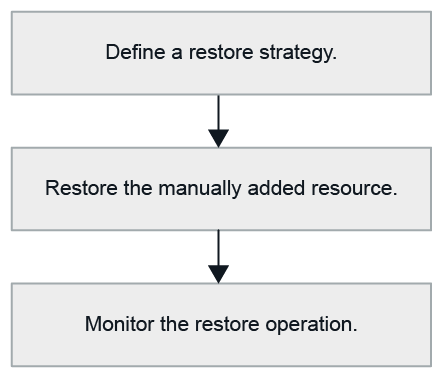

= Ripristina flusso di lavoro
:allow-uri-read: 
:icons: font
:imagesdir: ../media/

[role="lead"]
Il flusso di lavoro di ripristino e recupero include la pianificazione, l'esecuzione delle operazioni di ripristino e il monitoraggio delle operazioni.

Il seguente flusso di lavoro mostra la sequenza in cui è necessario eseguire l'operazione di ripristino:

È anche possibile utilizzare i cmdlet di PowerShell manualmente o negli script per eseguire operazioni di backup, ripristino e clonazione.  La guida del cmdlet SnapCenter e le informazioni di riferimento sul cmdlet contengono informazioni dettagliate sui cmdlet di PowerShell.

https://docs.netapp.com/us-en/snapcenter-cmdlets/index.html["Guida di riferimento ai cmdlet del software SnapCenter"^] .
