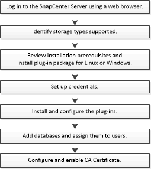

= Flusso di lavoro di installazione del plug-in SnapCenter per il database SAP HANA
:allow-uri-read: 
:icons: font
:imagesdir: ../media/

[role="lead"]
Se si desidera proteggere i database SAP HANA, è necessario installare e configurare il plug-in SnapCenter per il database SAP HANA.

