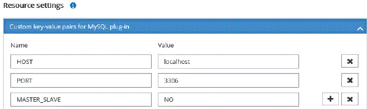

= Aggiungi risorse ai plug-in supportati da NetApp
:allow-uri-read: 
:icons: font
:imagesdir: ../media/

[role="lead"]
È necessario aggiungere le risorse di cui si desidera eseguire il backup o la clonazione.  A seconda dell'ambiente, le risorse potrebbero essere istanze di database o raccolte di cui si desidera eseguire il backup o la clonazione.

.Prima di iniziare
* È necessario aver completato attività quali l'installazione di SnapCenter Server, l'aggiunta di host, la creazione di connessioni al sistema di archiviazione e l'aggiunta di credenziali.
* È necessario aver caricato i plug-in su SnapCenter Server.

.Passi
. Nel riquadro di navigazione a sinistra, seleziona *Risorse*, quindi seleziona il plug-in appropriato dall'elenco.
. Nella pagina Risorse, seleziona *Aggiungi risorsa*.
. Nella pagina Fornisci dettagli risorsa, esegui le seguenti azioni:
+
|===
| Per questo campo... | Fai questo... 

 a| 
Nome
 a| 
Inserisci il nome della risorsa.

 a| 
Nome host
 a| 
Selezionare l'host.

 a| 
Tipo
 a| 
Seleziona il tipo.  Il tipo è definito dall'utente in base al file di descrizione del plug-in.  Ad esempio, database e istanza.

Nel caso in cui il tipo selezionato abbia un elemento padre, immettere i dettagli dell'elemento padre.  Ad esempio, se il tipo è Database e l'elemento padre è Istanza, immettere i dettagli dell'istanza.

 a| 
Nome della credenziale
 a| 
Seleziona Credenziale o crea una nuova credenziale.

 a| 
Sentieri del Monte
 a| 
Immettere i percorsi di montaggio in cui è montata la risorsa.  Questo è applicabile solo per un host Windows.

|===
. Nella pagina Fornisci impronta di archiviazione, seleziona un sistema di archiviazione e scegli uno o più volumi, LUN e qtree, quindi seleziona *Salva*.
+
Facoltativo: seleziona ilimage:../media/add_policy_from_resourcegroup.gif["Icona più"] icona per aggiungere più volumi, LUN e qtree da altri sistemi di archiviazione.

+

NOTE: I plug-in supportati NetApp non supportano il rilevamento automatico delle risorse.  Anche i dettagli di archiviazione degli ambienti fisici e virtuali non vengono rilevati automaticamente.  Durante la creazione delle risorse è necessario fornire le informazioni di archiviazione per gli ambienti fisici e virtuali.

+
image::../media/storage_footprint.png[Ingombro di archiviazione]

. Nella pagina Impostazioni risorsa, fornire coppie chiave-valore personalizzate per la risorsa.
+

NOTE: Assicurarsi che il nome delle chiavi personalizzate sia scritto in maiuscolo.

+

+
Per i rispettivi parametri del plug-in, fare riferimentolink:add_resources_to_netapp_supported_plugins.html#parameters-to-configure-the-resource["Parametri per configurare la risorsa"]

. Rivedi il riepilogo e seleziona *Fine*.

.Risultato
Le risorse vengono visualizzate insieme a informazioni quali tipo, nome dell'host o del cluster, gruppi di risorse e policy associati e stato generale.

IMPORTANT: È necessario aggiornare le risorse se i database vengono rinominati all'esterno di SnapCenter.

.Dopo aver finito
Se si desidera consentire l'accesso alle risorse ad altri utenti, l'amministratore SnapCenter deve assegnare le risorse a tali utenti.  Ciò consente agli utenti di eseguire le azioni per le quali dispongono delle autorizzazioni sulle risorse loro assegnate.

Dopo aver aggiunto le risorse, è possibile modificarne i dettagli.  Se a una risorsa plug-in supportata NetApp sono associati dei backup, non è possibile modificare i seguenti campi: nome della risorsa, tipo di risorsa e nome host.

== Parametri per configurare la risorsa

Se si aggiungono i plug-in manualmente, è possibile utilizzare i seguenti parametri per configurare la risorsa nella pagina Impostazioni risorsa.

=== Plug-in per MongoDB

Impostazioni delle risorse:

* MONGODB_APP_SERVER=(per tipo di risorsa come cluster shardato) o MONGODB_REPLICASET_SERVER=(per tipo di risorsa come replicaset)
* OPLOG_PATH=(Parametro facoltativo nel caso in cui venga fornito da MongoDB.propertiesfile)
* MONGODB_AUTHENTICATION_TYPE= (PLAIN per l'autenticazione LDAP e None per le altre)

È necessario fornire i seguenti parametri nel file MongoDB.properties:

* DISABILITA_AVVIO_ARRESTO_SERVIZI=
+
** N se i servizi di avvio/arresto vengono eseguiti dal plug-in.
** Y se i servizi di avvio/**arresto vengono eseguiti dall'utente.
** Il parametro facoltativo come valore predefinito è impostato su N.

* OPLOG_PATH_= (Parametro facoltativo nel caso in cui sia già fornito come coppia chiave-valore personalizzata in SnapCenter).

=== Plug-in per MaxDB

Impostazioni delle risorse:

* XUSER_ENABLE (Y|N) abilita o disabilita l'uso di un xuser per MaxDB in modo che non sia richiesta una password per l'utente del database.
* HANDLE_LOGWRITER (Y|N) esegue le operazioni di sospensione del logwriter (N) o di ripresa del logwriter (Y).
* DBMCLICMD (path_to_dbmcli_cmd) specifica il percorso al comando dbmcli di MaxDB.  Se non impostato, viene utilizzato dbmcli sul percorso di ricerca.

NOTE: Per l'ambiente Windows, il percorso deve essere racchiuso tra virgolette doppie ("...").

* SQLCLICMD (path_to_sqlcli_cmd) specifica il percorso al comando sqlcli di MaxDB.  Se il percorso non è impostato, nel percorso di ricerca viene utilizzato sqlcli.
* MAXDB_UPDATE_HIST_LOG (Y|N) indica al programma di backup di MaxDB se aggiornare il registro cronologico di MaxDB.
* MAXDB_CHECK_SNAPSHOT_DIR: Esempio, SID1:directory[,directory...]; [SID2:directoary[,directory...] verifica che un'operazione di copia Snap Creator Snapshot abbia esito positivo e garantisce che lo snapshot venga creato.
+
Questo vale solo per NFS.  La directory deve puntare alla posizione che contiene la directory .snapshot.  È possibile includere più directory in un elenco separato da virgole.

+
In MaxDB 7.8 e versioni successive, la richiesta di backup del database è contrassegnata come Non riuscita nella cronologia dei backup.

* MAXDB_BACKUP_TEMPLATES: specifica un modello di backup per ciascun database.
+
Il modello deve esistere ed essere un tipo esterno di modello di backup.  Per abilitare l'integrazione degli snapshot per MaxDB 7.8 e versioni successive, è necessario disporre della funzionalità del server in background MaxDB e di un modello di backup MaxDB di tipo ESTERNO già configurato.

* MAXDB_BG_SERVER_PREFIX: specifica il prefisso per il nome del server in background.
+
Se è impostato il parametro MAXDB_BACKUP_TEMPLATES, è necessario impostare anche il parametro MAXDB_BG_SERVER_PREFIX.  Se non si imposta il prefisso, verrà utilizzato il valore predefinito na_bg_.

=== Plug-in per SAP ASE

Impostazioni delle risorse:

* SYBASE_SERVER (data_server_name) specifica il nome del server dati Sybase (opzione -S nel comando isql).  Ad esempio, p_test.
* SYBASE_DATABASES_EXCLUDE (db_name) consente di escludere i database se viene utilizzato il costrutto "ALL".
+
È possibile specificare più database utilizzando un elenco separato da punto e virgola.  Ad esempio: pubs2;test_db1.

* SYBASE_USER: user_name specifica l'utente del sistema operativo che può eseguire il comando isql.
+
Richiesto per UNIX.  Questo parametro è obbligatorio se l'utente che esegue i comandi di avvio e arresto di Snap Creator Agent (in genere l'utente root) e l'utente che esegue il comando isql sono diversi.

* SYBASE_TRAN_DUMP db_name:directory_path consente di eseguire un dump delle transazioni Sybase dopo aver creato uno snapshot.  Ad esempio, pubs2:/sybasedumps/ pubs2
+
È necessario specificare ciascun database per il quale è necessario eseguire il dump delle transazioni.

* SYBASE_TRAN_DUMP_COMPRESS (Y|N ) abilita o disabilita la compressione nativa del dump delle transazioni Sybase.
* SYBASE_ISQL_CMD (ad esempio, /opt/sybase/OCS-15_0/bin/isql) definisce il percorso al comando isql.
* SYBASE_EXCLUDE_TEMPDB (Y|N) consente di escludere automaticamente i database temporanei creati dall'utente.

=== Plug-in per applicazioni Oracle (ORASCPM)

Impostazioni delle risorse:

* SQLPLUS_CMD specifica il percorso per SQLplus.
* ORACLE_DATABASES elenca i database Oracle di cui eseguire il backup e l'utente corrispondente (database:utente).
* CNTL_FILE_BACKUP_DIR specifica la directory per il backup del file di controllo.
* ORA_TEMP specifica la directory per i file temporanei.
* ORACLE_HOME specifica la directory in cui è installato il software Oracle.
* ARCHIVE_LOG_ONLY specifica se eseguire o meno il backup dei log di archivio.
* ORACLE_BACKUPMODE specifica se eseguire il backup online o offline.
* ORACLE_EXPORT_PARAMETERS specifica se le variabili di ambiente definite sopra devono essere riesportate durante l'esecuzione di _/bin/su <utente che esegue sqlplus> -c sqlplus /nolog <cmd>_.  Questo è in genere il caso in cui l'utente che esegue sqlplus non ha impostato tutte le variabili di ambiente necessarie per connettersi al database tramite _connect / come sysdba_.

