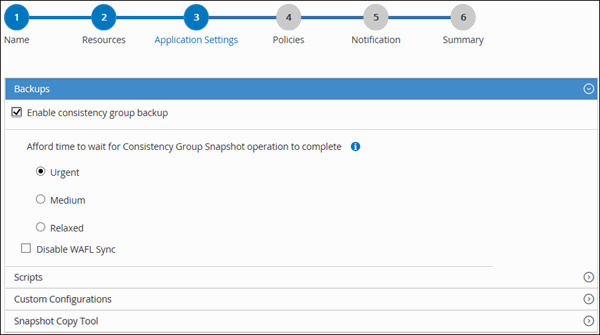

= Crea gruppi di risorse e allega criteri
:allow-uri-read: 
:icons: font
:imagesdir: ../media/

[role="lead"]
Un gruppo di risorse è il contenitore a cui è necessario aggiungere le risorse di cui si desidera eseguire il backup e la protezione.  Un gruppo di risorse consente di eseguire il backup simultaneo di tutti i dati associati a una determinata applicazione.  Per qualsiasi attività di protezione dei dati è necessario un gruppo di risorse.  È inoltre necessario allegare una o più policy al gruppo di risorse per definire il tipo di processo di protezione dei dati che si desidera eseguire.

.Informazioni su questo compito
* Per ONTAP 9.12.1 e versioni precedenti, i cloni creati dagli snapshot SnapLock Vault come parte del ripristino erediteranno il tempo di scadenza SnapLock Vault. L'amministratore dell'archiviazione deve pulire manualmente i cloni dopo la scadenza SnapLock .

.Passi
. Nel riquadro di navigazione a sinistra, fare clic su *Risorse*, quindi selezionare il plug-in appropriato dall'elenco.
. Nella pagina Risorse, fare clic su *Nuovo gruppo di risorse*.
. Nella pagina Nome, eseguire le seguenti azioni:
+
|===
| Per questo campo... | Fai questo... 

 a| 
Nome
 a| 
Immettere un nome per il gruppo di risorse.

NOTE: Il nome del gruppo di risorse non deve superare i 250 caratteri.

 a| 
Etichette
 a| 
Inserisci una o più etichette che ti aiuteranno a cercare in seguito il gruppo di risorse.

Ad esempio, se aggiungi HR come tag a più gruppi di risorse, potrai successivamente trovare tutti i gruppi di risorse associati al tag HR.

 a| 
Utilizza il formato del nome personalizzato per la copia snapshot
 a| 
Selezionare questa casella di controllo e immettere un formato di nome personalizzato che si desidera utilizzare per il nome dello snapshot.

Ad esempio, customtext_resource group_policy_hostname o resource group_hostname.  Per impostazione predefinita, al nome dello snapshot viene aggiunto un timestamp.

|===
. Nella pagina Risorse, seleziona un nome host dall'elenco a discesa *Host* e il tipo di risorsa dall'elenco a discesa *Tipo di risorsa*.
+
Ciò aiuta a filtrare le informazioni sullo schermo.

. Seleziona le risorse dalla sezione *Risorse disponibili*, quindi fai clic sulla freccia destra per spostarle nella sezione *Risorse selezionate*.
. Nella pagina Impostazioni applicazione, procedere come segue:
+
.. Fare clic sulla freccia *Backup* per impostare opzioni di backup aggiuntive:
+
Abilitare il backup del gruppo di coerenza ed eseguire le seguenti attività:

+
|===
| Per questo campo... | Fai questo... 

 a| 
Concediti del tempo per attendere il completamento dell'operazione di snapshot del gruppo di coerenza
 a| 
Selezionare *Urgente*, *Medio* o *Rilassato* per specificare il tempo di attesa per il completamento dell'operazione di snapshot.

Urgente = 5 secondi, Medio = 7 secondi e Rilassato = 20 secondi.

 a| 
Disabilita la sincronizzazione WAFL
 a| 
Selezionare questa opzione per evitare di forzare un punto di coerenza WAFL .

|===
+

.. Fare clic sulla freccia *Script* e immettere i comandi pre e post per le operazioni di quiesce, snapshot e unquiesce.  È anche possibile immettere i comandi pre da eseguire prima di uscire in caso di errore.
.. Fare clic sulla freccia *Configurazioni personalizzate* e immettere le coppie chiave-valore personalizzate richieste per tutte le operazioni di protezione dei dati che utilizzano questa risorsa.
+
|===
| Parametro | Collocamento | Descrizione 

 a| 
ARCHIVE_LOG_ENABLE
 a| 
(S/N)
 a| 
Abilita la gestione dei log di archivio per eliminare i log di archivio.

 a| 
CONSERVAZIONE_ARCHIVIO_LOG
 a| 
numero_di_giorni
 a| 
Specifica il numero di giorni per cui vengono conservati i registri di archivio.

Questa impostazione deve essere uguale o maggiore di NTAP_SNAPSHOT_ RETENTIONS.

 a| 
ARCHIVE_LOG_DIR
 a| 
change_info_directory/logs
 a| 
Specifica il percorso della directory che contiene i log di archivio.

 a| 
ARCHIVE_LOG_EXT
 a| 
estensione_file
 a| 
Specifica la lunghezza dell'estensione del file di registro dell'archivio.

Ad esempio, se il registro di archivio è log_backup_0_0_0_0.161518551942 9 e se il valore file_extension è 5, l'estensione del registro conserverà 5 cifre, ovvero 16151.

 a| 
ARCHIVE_LOG_RECURSIVE_SE ARCH
 a| 
(S/N)
 a| 
Consente la gestione dei log di archivio all'interno delle sottodirectory.

È necessario utilizzare questo parametro se i registri di archivio si trovano in sottodirectory.

|===
+

NOTE: Le coppie chiave-valore personalizzate sono supportate per i sistemi plug-in Linux PostgreSQL e non sono supportate per i cluster PostgreSQL registrati come plug-in Windows centralizzato.

.. Fare clic sulla freccia *Strumento Copia snapshot* per selezionare lo strumento per creare snapshot:
+
|===
| Se vuoi... | Poi... 

 a| 
SnapCenter utilizza il plug-in per Windows e imposta il file system in uno stato coerente prima di creare uno snapshot.  Per le risorse Linux, questa opzione non è applicabile.
 a| 
Selezionare * SnapCenter con coerenza del file system*.

 a| 
SnapCenter per creare uno snapshot del livello di archiviazione
 a| 
Selezionare * SnapCenter senza coerenza del file system*.

 a| 
Per immettere il comando da eseguire sull'host per creare copie snapshot.
 a| 
Selezionare *Altro*, quindi immettere il comando da eseguire sull'host per creare uno snapshot.

|===

. Nella pagina Criteri, procedere come segue:
+
.. Selezionare una o più policy dall'elenco a discesa.
+

NOTE: Puoi anche creare una policy cliccando * *.

+
I criteri sono elencati nella sezione Configura pianificazioni per i criteri selezionati.

.. Nella colonna Configura pianificazioni, fare clic su * * per la policy che vuoi configurare.
.. Nella finestra di dialogo Aggiungi pianificazioni per il criterio _nome_criterio_, configurare la pianificazione, quindi fare clic su *OK*.
+
Dove policy_name è il nome della policy selezionata.

+
Le pianificazioni configurate sono elencate nella colonna *Pianificazioni applicate*.

+
Le pianificazioni di backup di terze parti non sono supportate quando si sovrappongono alle pianificazioni di backup SnapCenter .

. Nella pagina Notifica, dall'elenco a discesa *Preferenza e-mail*, seleziona gli scenari in cui desideri inviare le e-mail.
+
È necessario specificare anche gli indirizzi email del mittente e del destinatario, nonché l'oggetto dell'email.  Il server SMTP deve essere configurato in *Impostazioni* > *Impostazioni globali*.

. Rivedi il riepilogo e poi clicca su *Fine*.

