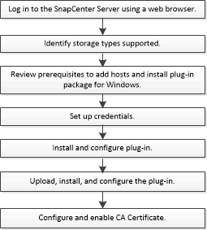

= Flusso di lavoro di installazione del plug-in SnapCenter per Microsoft Exchange Server
:allow-uri-read: 
:icons: font
:imagesdir: ../media/

[role="lead"]
Se si desidera proteggere i database di Exchange, è necessario installare e configurare il plug-in SnapCenter per Microsoft Exchange Server.

