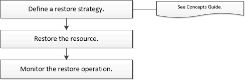

= Ripristina flusso di lavoro
:allow-uri-read: 
:icons: font
:imagesdir: ../media/

[role="lead"]
È possibile utilizzare SnapCenter per ripristinare i database di Exchange ripristinando uno o più backup nel file system attivo.

Il seguente flusso di lavoro mostra la sequenza in cui è necessario eseguire le operazioni di ripristino del database di Exchange:

È anche possibile utilizzare i cmdlet di PowerShell manualmente o negli script per eseguire operazioni di backup e ripristino.  Per informazioni dettagliate sui cmdlet di PowerShell, utilizzare la guida del cmdlet SnapCenter o vedere https://docs.netapp.com/us-en/snapcenter-cmdlets/index.html["Guida di riferimento ai cmdlet del software SnapCenter"^] .
