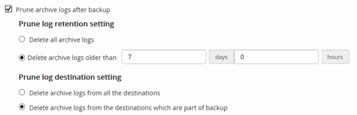

= Creare policy di backup per i database Oracle
:allow-uri-read: 
:icons: font
:imagesdir: ../media/

[role="lead"]
Prima di utilizzare SnapCenter per eseguire il backup delle risorse del database Oracle, è necessario creare un criterio di backup per la risorsa o il gruppo di risorse di cui si desidera eseguire il backup.  Una policy di backup è un insieme di regole che regolano il modo in cui si gestiscono, si pianificano e si conservano i backup.  È inoltre possibile specificare le impostazioni relative a replica, script e tipo di backup.  La creazione di un criterio consente di risparmiare tempo quando si desidera riutilizzarlo su un'altra risorsa o un altro gruppo di risorse.

*Prima di iniziare*

* Devi aver definito la tua strategia di backup.
* È necessario prepararsi alla protezione dei dati completando attività quali l'installazione SnapCenter, l'aggiunta di host, l'individuazione di database e la creazione di connessioni al sistema di archiviazione.
* Se si replicano gli snapshot su un mirror o su un archivio secondario vault, l'amministratore SnapCenter deve aver assegnato le SVM sia per il volume di origine che per quello di destinazione.
* Se hai installato il plug-in come utente non root, dovresti assegnare manualmente i permessi di esecuzione alle directory prescript e postscript.
* Esaminare i prerequisiti e le limitazioni specifici SnapMirror ActiveSync. Per informazioni, fare riferimento https://docs.netapp.com/us-en/ontap/smbc/considerations-limits.html#volumes["Limiti degli oggetti per la sincronizzazione attiva SnapMirror"] .

.Informazioni su questo compito
Se è selezionata l'opzione "Conserva le copie di backup per un numero specifico di giorni", il periodo di conservazione SnapLock deve essere inferiore o uguale ai giorni di conservazione indicati.

+ Specificando un periodo di blocco degli snapshot si impedisce l'eliminazione degli snapshot fino alla scadenza del periodo di conservazione. Ciò potrebbe comportare la conservazione di un numero di snapshot maggiore rispetto al conteggio specificato nella policy.

+ Per ONTAP 9.12.1 e versioni precedenti, i cloni creati dagli SnapLock Vault Snapshot come parte del ripristino erediteranno il tempo di scadenza SnapLock Vault. L'amministratore dell'archiviazione deve pulire manualmente i cloni dopo la scadenza SnapLock .

*Passi*

. Nel riquadro di navigazione a sinistra, fare clic su *Impostazioni*.
. Nella pagina Impostazioni, fare clic su *Criteri*.
. Selezionare *Oracle Database* dall'elenco a discesa.
. Fare clic su *Nuovo*.
. Nella pagina Nome, immettere il nome e i dettagli della policy.
. Nella pagina Tipo di policy, procedere come segue:
+
.. Seleziona il tipo di archiviazione.
.. Seleziona l'ambito della policy:
+
*** Se vuoi *creare un backup online*, seleziona *Backup online*.
+
È necessario specificare se si desidera eseguire il backup di tutti i file di dati, dei file di controllo e dei file di registro di archivio, solo dei file di dati e dei file di controllo o solo dei file di registro di archivio.

*** Se vuoi *creare un backup offline*, seleziona *Backup offline*, quindi seleziona una delle seguenti opzioni:
+
**** Se si desidera creare un backup offline quando il database è montato, selezionare *Monta*.
**** Se si desidera creare un backup di arresto offline modificando lo stato del database in stato di arresto, selezionare *Arresto*.
+
Se si dispone di database collegabili (PDB) e si desidera salvare lo stato dei PDB prima di creare il backup, è necessario selezionare *Salva stato dei PDB*.  Ciò consente di riportare i PDB al loro stato originale dopo la creazione del backup.

.. Se si desidera catalogare il backup utilizzando Oracle Recovery Manager (RMAN), selezionare *Catalog backup with Oracle Recovery Manager (RMAN)*.
+
È possibile eseguire la catalogazione differita per un backup alla volta utilizzando l'interfaccia utente grafica (GUI) o il comando Catalog-SmBackupWithOracleRMAN della CLI SnapCenter .

+

NOTE: Se si desidera catalogare i backup di un database RAC, assicurarsi che non sia in esecuzione nessun altro processo per quel database.  Se è in esecuzione un altro processo, l'operazione di catalogazione fallisce anziché essere messa in coda.

.. Se si desidera eliminare i log di archivio dopo il backup, selezionare *Elimina log di archivio dopo il backup*.
+

NOTE: L'eliminazione dei log di archivio dalla destinazione del log di archivio non configurata nel database verrà ignorata.

+

IMPORTANT: Se si utilizza Oracle Standard Edition, è possibile utilizzare i parametri LOG_ARCHIVE_DEST e LOG_ARCHIVE_DUPLEX_DEST durante l'esecuzione del backup del log di archivio.

+
*** È possibile eliminare i registri di archivio solo se sono stati selezionati i file di registro di archivio come parte del backup.
+

NOTE: Affinché l'operazione di eliminazione abbia esito positivo, è necessario assicurarsi che tutti i nodi in un ambiente RAC possano accedere a tutte le posizioni dei registri di archivio.

+
|===
| Se lo desidera... | Poi... 

 a| 
Elimina tutti i registri di archivio
 a| 
Seleziona *Elimina tutti i registri di archivio*.

 a| 
Elimina i registri di archivio più vecchi
 a| 
Selezionare *Elimina i registri di archivio più vecchi di*, quindi specificare l'età dei registri di archivio da eliminare in giorni e ore.

 a| 
Elimina i log di archivio da tutte le destinazioni
 a| 
Selezionare *Elimina i log di archivio da tutte le destinazioni*.

 a| 
Eliminare i log di archivio dalle destinazioni dei log che fanno parte del backup
 a| 
Selezionare *Elimina i registri di archivio dalle destinazioni che fanno parte del backup*.

|===
+

. Nella pagina Snapshot e replica, procedere come segue:
+
.. Specificare la frequenza di programmazione selezionando *Su richiesta*, *Ogni ora*, *Giornaliera*, *Settimanale* o *Mensile*.
+

NOTE: È possibile specificare la pianificazione (data di inizio e data di fine) per l'operazione di backup durante la creazione di un gruppo di risorse.  Ciò consente di creare gruppi di risorse che condividono la stessa policy e la stessa frequenza di backup, ma consente di assegnare pianificazioni di backup diverse a ciascuna policy.

+

NOTE: Se hai programmato per le 2:00, la pianificazione non verrà attivata durante l'ora legale (DST).

.. Nella sezione Impostazioni di conservazione degli snapshot dei dati, specificare le impostazioni di conservazione per il tipo di backup e il tipo di pianificazione selezionati nella pagina Tipo di backup:
+
|===

| Se lo desidera... | Poi... 

 a| 
Conserva un certo numero di snapshot
 a| 
Seleziona *Copie da conservare*, quindi specifica il numero di snapshot che desideri conservare.

Se il numero di Snapshot supera il numero specificato, gli Snapshot vengono eliminati partendo dalle copie più vecchie.

NOTE: Il valore massimo di ritenzione è 1018. I backup non riusciranno se la conservazione è impostata su un valore superiore a quello supportato dalla versione ONTAP sottostante.

IMPORTANT: Se si prevede di abilitare la replica SnapVault , è necessario impostare il conteggio di conservazione su 2 o su un valore superiore.  Se si imposta il conteggio di conservazione su 1, l'operazione di conservazione potrebbe non riuscire perché il primo Snapshot è lo Snapshot di riferimento per la relazione SnapVault finché uno Snapshot più recente non viene replicato sulla destinazione.

 a| 
Conserva gli snapshot per un certo numero di giorni
 a| 
Selezionare *Conserva copie per*, quindi specificare il numero di giorni per cui si desidera conservare gli snapshot prima di eliminarli.

 a| 
Periodo di blocco della copia snapshot
 a| 
Selezionare il *Periodo di blocco della copia snapshot* e specificare la durata in giorni, mesi o anni.

Il periodo di conservazione SnapLock dovrebbe essere inferiore a 100 anni.

|===
.. Nella sezione Impostazioni di conservazione degli snapshot del registro di archivio, specificare le impostazioni di conservazione per il tipo di backup e il tipo di pianificazione selezionati nella pagina Tipo di backup:
+
|===

| Se lo desidera... | Poi... 

 a| 
Conserva un certo numero di snapshot
 a| 
Seleziona *Copie da conservare*, quindi specifica il numero di snapshot che desideri conservare.

Se il numero di Snapshot supera il numero specificato, gli Snapshot vengono eliminati partendo dalle copie più vecchie.

NOTE: Il valore massimo di ritenzione è 1018. I backup non riusciranno se la conservazione è impostata su un valore superiore a quello supportato dalla versione ONTAP sottostante.

IMPORTANT: Se si prevede di abilitare la replica SnapVault , è necessario impostare il conteggio di conservazione su 2 o su un valore superiore.  Se si imposta il conteggio di conservazione su 1, l'operazione di conservazione potrebbe non riuscire perché il primo Snapshot è lo Snapshot di riferimento per la relazione SnapVault finché uno Snapshot più recente non viene replicato sulla destinazione.

 a| 
Conserva gli snapshot per un certo numero di giorni
 a| 
Selezionare *Conserva copie per*, quindi specificare il numero di giorni per cui si desidera conservare gli snapshot prima di eliminarli.

 a| 
Periodo di blocco della copia snapshot
 a| 
Selezionare il *Periodo di blocco della copia snapshot* e specificare la durata in giorni, mesi o anni.

Il periodo di conservazione SnapLock dovrebbe essere inferiore a 100 anni.

|===
.. Seleziona l'etichetta della policy.
+

NOTE: È possibile assegnare etichette SnapMirror agli snapshot primari per la replica remota, consentendo agli snapshot primari di trasferire l'operazione di replica degli snapshot da SnapCenter ai sistemi secondari ONTAP . Questa operazione può essere eseguita senza abilitare l'opzione SnapMirror o SnapVault nella pagina dei criteri.

. Nella sezione Seleziona opzioni di replicazione secondaria, seleziona una o entrambe le seguenti opzioni di replicazione secondaria:
+

NOTE: Per rendere effettivo il *Periodo di blocco della copia snapshot secondaria*, è necessario selezionare le opzioni di replica secondaria.

+
|===
| Per questo campo... | Fai questo... 

 a| 
Aggiorna SnapMirror dopo aver creato uno Snapshot locale
 a| 
Selezionare questo campo per creare copie mirror dei set di backup su un altro volume (replica SnapMirror ).

Questa opzione dovrebbe essere abilitata per la sincronizzazione attiva SnapMirror .

Durante la replicazione secondaria, il tempo di scadenza SnapLock carica il tempo di scadenza SnapLock primario.

Facendo clic sul pulsante *Aggiorna* nella pagina Topologia, vengono aggiornati i tempi di scadenza SnapLock secondari e primari recuperati da ONTAP.

 a| 
Aggiorna SnapVault dopo aver creato uno Snapshot locale
 a| 
Selezionare questa opzione per eseguire la replica del backup da disco a disco (backup SnapVault ).

Quando SnapLock è configurato solo sul secondario da ONTAP noto come SnapLock Vault, facendo clic sul pulsante *Aggiorna* nella pagina Topologia si aggiorna il periodo di blocco sul secondario recuperato da ONTAP.

Per maggiori informazioni su SnapLock Vault vedere https://docs.netapp.com/us-en/ontap/snaplock/commit-snapshot-copies-worm-concept.html["Eseguire il commit delle copie Snapshot su WORM in una destinazione vault"]

Vedere link:../protect-sco/task_view_oracle_databse_backups_and_clones_in_the_topology_page.html["Visualizza i backup e i cloni del database Oracle nella pagina Topologia"] .

 a| 
Errore nel conteggio dei tentativi
 a| 
Immettere il numero massimo di tentativi di replica consentiti prima che l'operazione venga interrotta.

|===
+

NOTE: È necessario configurare i criteri di conservazione SnapMirror in ONTAP per l'archiviazione secondaria per evitare di raggiungere il limite massimo di snapshot sull'archiviazione secondaria.

. Nella pagina Script, immettere il percorso e gli argomenti del prescript o del postscript che si desidera eseguire rispettivamente prima o dopo l'operazione di backup.
+
È necessario memorizzare i prescript e i postscript in _/var/opt/snapcenter/spl/scripts_ o in una cartella qualsiasi all'interno di questo percorso.  Per impostazione predefinita, viene compilato il percorso _/var/opt/snapcenter/spl/scripts_.  Se hai creato delle cartelle all'interno di questo percorso per archiviare gli script, devi specificare tali cartelle nel percorso.

+
È anche possibile specificare il valore di timeout dello script. Il valore predefinito è 60 secondi.

+
SnapCenter consente di utilizzare le variabili di ambiente predefinite quando si eseguono prescript e postscript.link:../protect-sco/predefined-environment-variables-prescript-postscript-backup.html["Saperne di più"^]

. Nella pagina Verifica, procedere come segue:
+
.. Selezionare la pianificazione del backup per la quale si desidera eseguire l'operazione di verifica.
.. Nella sezione Comandi dello script di verifica, immettere il percorso e gli argomenti del prescript o del postscript che si desidera eseguire rispettivamente prima o dopo l'operazione di verifica.
+
È necessario memorizzare i prescript e i postscript in _/var/opt/snapcenter/spl/scripts_ o in una cartella qualsiasi all'interno di questo percorso.  Per impostazione predefinita, viene compilato il percorso _/var/opt/snapcenter/spl/scripts_.  Se hai creato delle cartelle all'interno di questo percorso per archiviare gli script, devi specificare tali cartelle nel percorso.

+
È anche possibile specificare il valore di timeout dello script. Il valore predefinito è 60 secondi.

. Rivedi il riepilogo e poi clicca su *Fine*.

