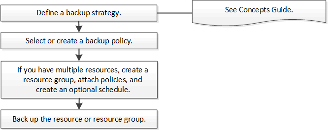

= Flusso di lavoro di backup
:allow-uri-read: 
:icons: font
:imagesdir: ../media/

[role="lead"]
Quando installi il plug-in SnapCenter per Microsoft SQL Server nel tuo ambiente, puoi utilizzare SnapCenter per eseguire il backup delle risorse di SQL Server.

È possibile pianificare più backup da eseguire contemporaneamente su più server.

Le operazioni di backup e ripristino non possono essere eseguite contemporaneamente sulla stessa risorsa.

Il seguente flusso di lavoro mostra la sequenza in cui è necessario eseguire le operazioni di backup:

NOTE: Le opzioni Esegui backup ora, Ripristina, Gestisci backup e Clona nella pagina Risorse sono disabilitate se si seleziona un LUN non NetApp , un database danneggiato o un database in fase di ripristino.

È anche possibile utilizzare i cmdlet di PowerShell manualmente o negli script per eseguire operazioni di backup, ripristino, recupero, verifica e clonazione.  Per informazioni dettagliate sui cmdlet di PowerShell, utilizzare la guida del cmdlet SnapCenter o vedere https://docs.netapp.com/us-en/snapcenter-cmdlets/index.html["Guida di riferimento ai cmdlet del software SnapCenter"]

== Come SnapCenter esegue il backup dei database

SnapCenter utilizza la tecnologia Snapshot per eseguire il backup dei database SQL Server che risiedono su LUN o VMDK.  SnapCenter crea il backup creando snapshot dei database.

Quando si seleziona un database per un backup completo dalla pagina Risorse, SnapCenter seleziona automaticamente tutti gli altri database che risiedono sullo stesso volume di archiviazione.  Se il LUN o il VMDK memorizza un solo database, è possibile cancellare o riselezionare il database singolarmente.  Se la LUN o il VMDK ospita più database, è necessario cancellare o riselezionare i database come gruppo.

Tutti i database che risiedono su un singolo volume vengono sottoposti a backup contemporaneamente tramite snapshot.  Se il numero massimo di database di backup simultanei è 35 e se in un volume di archiviazione risiedono più di 35 database, il numero totale di snapshot creati è uguale al numero di database diviso per 35.

NOTE: È possibile configurare il numero massimo di database per ogni snapshot nella policy di backup.

Quando SnapCenter crea uno Snapshot, l'intero volume del sistema di archiviazione viene catturato nello Snapshot.  Tuttavia, il backup è valido solo per il server host SQL per il quale è stato creato.

Se i dati provenienti da altri server host SQL risiedono sullo stesso volume, non è possibile ripristinarli dallo snapshot.

*Trova maggiori informazioni*

link:https://kb.netapp.com/Advice_and_Troubleshooting/Data_Protection_and_Security/SnapCenter/Quiesce_or_grouping_resources_operations_fail["Le operazioni di quiesce o di raggruppamento delle risorse falliscono"]
