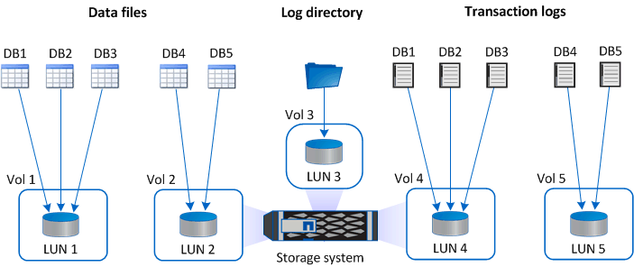
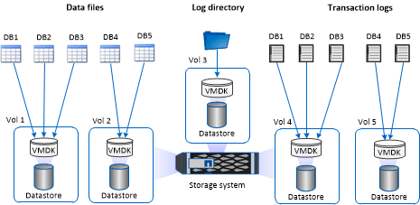

= Raccomandazioni sul layout di archiviazione per il plug-in SnapCenter per Microsoft SQL Server
:allow-uri-read: 
:icons: font
:imagesdir: ../media/

[role="lead"]
Un layout di archiviazione ben progettato consente a SnapCenter Server di eseguire il backup dei database per soddisfare gli obiettivi di ripristino.  Quando si definisce il layout di archiviazione, è necessario considerare diversi fattori, tra cui le dimensioni del database, la velocità di modifica del database e la frequenza con cui si eseguono i backup.

Nelle sezioni seguenti vengono definiti i consigli e le restrizioni sul layout di archiviazione per LUN e dischi di macchine virtuali (VMDK) con il plug-in SnapCenter per Microsoft SQL Server installato nel tuo ambiente.

In questo caso, le LUN possono includere dischi VMware RDM e LUN collegate direttamente iSCSI mappate sul guest.

== Requisiti LUN e VMDK

Facoltativamente, è possibile utilizzare LUN o VMDK dedicati per prestazioni e gestione ottimali dei seguenti database:

* Database di sistema master e modello
* Database temporaneo
* File di database utente (.mdf e .ndf)
* File di registro delle transazioni del database utente (.ldf)
* Directory dei registri

Per ripristinare database di grandi dimensioni, la procedura consigliata è quella di utilizzare LUN o VMDK dedicati.  Il tempo impiegato per ripristinare un LUN o un VMDK completo è inferiore al tempo impiegato per ripristinare i singoli file archiviati nel LUN o nel VMDK.

Per la directory del registro, è necessario creare un LUN o un VMDK separato in modo che vi sia spazio libero sufficiente nei dischi dei file di dati o di registro.

== Layout di esempio LUN e VMDK

Il seguente grafico mostra come configurare il layout di archiviazione per database di grandi dimensioni su LUN:

image::../media/smsql_storage_layout_mult_vols_snapcenter.gif[Diagramma LUN multipli]

Il seguente grafico mostra come configurare il layout di archiviazione per database di medie o piccole dimensioni su LUN:

Il seguente grafico mostra come configurare il layout di archiviazione per database di grandi dimensioni su VMDK:

image::../media/smsql_storage_layout_large_dbs_vmdk.gif[Layout di archiviazione per database di grandi dimensioni su VMDK]

Il seguente grafico mostra come configurare il layout di archiviazione per database di medie o piccole dimensioni su VMDK:

