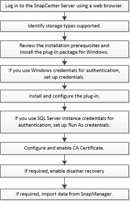

= Flusso di lavoro di installazione per il plug-in SnapCenter per Microsoft SQL Server
:allow-uri-read: 
:icons: font
:imagesdir: ../media/

[role="lead"]
Se si desidera proteggere i database di SQL Server, è necessario installare e configurare il plug-in SnapCenter per Microsoft SQL Server.

