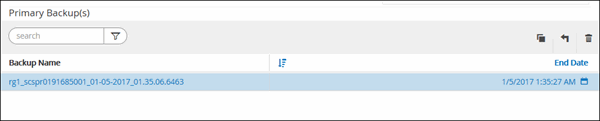

= Ripristinare i backup del database di SQL Server
:allow-uri-read: 
:icons: font
:imagesdir: ../media/

[role="lead"]
È possibile utilizzare SnapCenter per ripristinare i database SQL Server sottoposti a backup.  Il ripristino del database è un processo multifase che copia tutti i dati e le pagine di registro da un backup di SQL Server specificato a un database specificato.

.Informazioni su questo compito
* È possibile ripristinare i database SQL Server sottoposti a backup in un'istanza diversa di SQL Server sullo stesso host in cui è stato creato il backup.
+
È possibile utilizzare SnapCenter per ripristinare i database SQL Server sottoposti a backup in un percorso alternativo, in modo da non dover sostituire una versione di produzione.

* SnapCenter può ripristinare i database in un cluster Windows senza disconnettere il gruppo di cluster SQL Server.
* Se si verifica un errore del cluster (un'operazione di spostamento di un gruppo di cluster) durante un'operazione di ripristino (ad esempio, se il nodo proprietario delle risorse si arresta), è necessario riconnettersi all'istanza di SQL Server e quindi riavviare l'operazione di ripristino.
* Non è possibile ripristinare il database quando gli utenti o i processi di SQL Server Agent accedono al database.
* Non è possibile ripristinare i database di sistema in un percorso alternativo.
* SCRIPTS_PATH viene definito utilizzando la chiave PredefinedWindowsScriptsDirectory che si trova nel file SMCoreServiceHost.exe.Config dell'host del plug-in.
+
Se necessario, è possibile modificare questo percorso e riavviare il servizio SMcore.  Per motivi di sicurezza, si consiglia di utilizzare il percorso predefinito.

+
Il valore della chiave può essere visualizzato da Swagger tramite l'API: API /4.7/configsettings

+
È possibile utilizzare l'API GET per visualizzare il valore della chiave.  L'API SET non è supportata.

* La maggior parte dei campi nelle pagine della procedura guidata di ripristino sono autoesplicativi.  Le seguenti informazioni descrivono i campi per i quali potresti aver bisogno di assistenza.
* Per l'operazione di ripristino di SnapMirror ActiveSync, è necessario selezionare il backup dalla posizione principale.
* Per i criteri abilitati per SnapLock , per ONTAP 9.12.1 e versioni precedenti, se si specifica un periodo di blocco degli snapshot, i cloni creati dagli snapshot antimanomissione come parte del ripristino erediteranno il tempo di scadenza SnapLock . L'amministratore dell'archiviazione deve pulire manualmente i cloni dopo la scadenza SnapLock .

[role="tabbed-block"]
====
.Interfaccia utente SnapCenter
--
.Passi
. Nel riquadro di navigazione a sinistra, fare clic su *Risorse*, quindi selezionare il plug-in appropriato dall'elenco.
. Nella pagina Risorse, seleziona *Database* o *Gruppo di risorse* dall'elenco *Visualizza*.
. Selezionare il database o il gruppo di risorse dall'elenco.
+
Viene visualizzata la pagina della topologia.

. Dalla vista Gestisci copie, seleziona *Backup* dal sistema di archiviazione.
. Selezionare il backup dalla tabella, quindi fare clic suimage:../media/restore_icon.gif["icona di ripristino"] icona.
+

. Nella pagina Ambito di ripristino, seleziona una delle seguenti opzioni:
+
|===
| Opzione | Descrizione 

 a| 
Ripristinare il database sullo stesso host in cui è stato creato il backup
 a| 
Selezionare questa opzione se si desidera ripristinare il database sullo stesso server SQL in cui vengono eseguiti i backup.

 a| 
Ripristinare il database su un host alternativo
 a| 
Selezionare questa opzione se si desidera che il database venga ripristinato su un server SQL diverso nello stesso host o in uno diverso in cui vengono eseguiti i backup.

Selezionare un nome host, fornire un nome di database (facoltativo), selezionare un'istanza e specificare i percorsi di ripristino.

NOTE: L'estensione del file fornita nel percorso alternativo deve essere la stessa dell'estensione del file del database originale.

Se l'opzione *Ripristina il database su un host alternativo* non viene visualizzata nella pagina Ambito di ripristino, cancellare la cache del browser.

 a| 
Ripristinare il database utilizzando i file di database esistenti
 a| 
Selezionare questa opzione se si desidera che il database venga ripristinato su un SQL Server alternativo nello stesso host o in uno diverso in cui vengono eseguiti i backup.

I file del database devono essere già presenti nei percorsi dei file esistenti specificati.  Selezionare un nome host, fornire un nome di database (facoltativo), selezionare un'istanza e specificare i percorsi di ripristino.

|===
. Nella pagina Ambito di ripristino, seleziona una delle seguenti opzioni:
+
|===
| Opzione | Descrizione 

 a| 
Nessuno
 a| 
Selezionare *Nessuno* quando è necessario ripristinare solo il backup completo senza alcun registro.

 a| 
Tutti i backup del registro
 a| 
Selezionare l'operazione di ripristino del backup aggiornato *Tutti i backup del registro* per ripristinare tutti i backup del registro disponibili dopo il backup completo.

 a| 
Tramite backup del registro fino a
 a| 
Selezionare *Tramite backup del registro* per eseguire un'operazione di ripristino in un punto temporale specifico, che ripristina il database in base ai registri di backup fino al registro di backup con la data selezionata.

 a| 
Entro una data specifica fino a
 a| 
Selezionare *In base a una data specifica fino a* per specificare la data e l'ora dopo le quali i registri delle transazioni non vengono applicati al database ripristinato.

Questa operazione di ripristino in un dato momento interrompe il ripristino delle voci del registro delle transazioni registrate dopo la data e l'ora specificate.

 a| 
Utilizza directory di registro personalizzata
 a| 
Se hai selezionato *Tutti i backup dei log*, *Per backup dei log* o *Per data specifica fino a* e i log si trovano in una posizione personalizzata, seleziona *Usa directory dei log personalizzata*, quindi specifica la posizione del log.

L'opzione *Usa directory di registro personalizzata* è disponibile solo se è stata selezionata l'opzione *Ripristina il database su un host alternativo* o *Ripristina il database utilizzando i file di database esistenti*.  È anche possibile utilizzare il percorso condiviso, ma assicurarsi che sia accessibile all'utente SQL.

NOTE: La directory di registro personalizzata non è supportata per il database del gruppo di disponibilità.

|===
. Nella pagina Pre Ops, eseguire i seguenti passaggi:
+
.. Nella pagina Opzioni pre-ripristino, seleziona una delle seguenti opzioni:
+
*** Selezionare *Sovrascrivi il database con lo stesso nome durante il ripristino* per ripristinare il database con lo stesso nome.
*** Selezionare *Mantieni impostazioni di replica del database SQL* per ripristinare il database e mantenere le impostazioni di replica esistenti.
*** Selezionare *Crea backup del registro delle transazioni prima del ripristino* per creare un registro delle transazioni prima dell'inizio dell'operazione di ripristino.
*** Selezionare *Interrompi ripristino se il backup del registro delle transazioni prima del ripristino non riesce* per interrompere l'operazione di ripristino se il backup del registro delle transazioni non riesce.

.. Specificare gli script facoltativi da eseguire prima di eseguire un processo di ripristino.
+
Ad esempio, è possibile eseguire uno script per aggiornare le trap SNMP, automatizzare gli avvisi, inviare registri e così via.

+

NOTE: Il percorso prescripts o postscripts non deve includere unità o condivisioni.  Il percorso dovrebbe essere relativo a SCRIPTS_PATH.

. Nella pagina Post Ops, eseguire i seguenti passaggi:
+
.. Nella sezione Scegli lo stato del database al termine del ripristino, seleziona una delle seguenti opzioni:
+
*** Selezionare *Operativo, ma non disponibile per il ripristino di registri delle transazioni aggiuntivi* se si desidera ripristinare tutti i backup necessari in questo momento.
+
Questo è il comportamento predefinito, che lascia il database pronto per l'uso eseguendo il rollback delle transazioni non confermate.  Non è possibile ripristinare ulteriori registri delle transazioni finché non si crea un backup.

*** Selezionare *Non operativo, ma disponibile per il ripristino di ulteriori log transazionali* per lasciare il database non operativo senza eseguire il rollback delle transazioni non confermate.
+
È possibile ripristinare ulteriori registri delle transazioni.  Non è possibile utilizzare il database finché non viene ripristinato.

*** Selezionare *Modalità di sola lettura, disponibile per il ripristino di registri transazionali aggiuntivi* per lasciare il database in modalità di sola lettura.
+
Questa opzione annulla le transazioni non eseguite, ma salva le azioni annullate in un file di standby in modo che gli effetti del ripristino possano essere annullati.

+
Se l'opzione Annulla directory è abilitata, vengono ripristinati più registri delle transazioni.  Se l'operazione di ripristino del registro delle transazioni non riesce, è possibile annullare le modifiche.  Per ulteriori informazioni, consultare la documentazione di SQL Server.

.. Specificare gli script facoltativi da eseguire dopo aver eseguito un processo di ripristino.
+
Ad esempio, è possibile eseguire uno script per aggiornare le trap SNMP, automatizzare gli avvisi, inviare registri e così via.

+

NOTE: Il percorso prescripts o postscripts non deve includere unità o condivisioni.  Il percorso dovrebbe essere relativo a SCRIPTS_PATH.

. Nella pagina Notifica, dall'elenco a discesa *Preferenza e-mail*, seleziona gli scenari in cui desideri inviare le e-mail.
+
È necessario specificare anche gli indirizzi email del mittente e del destinatario, nonché l'oggetto dell'email.

. Rivedi il riepilogo e poi clicca su *Fine*.
. Monitorare il processo di ripristino utilizzando la pagina *Monitor* > *Jobs*.

--
.Cmdlet di PowerShell
--
.Passi
. Avvia una sessione di connessione con SnapCenter Server per un utente specificato utilizzando il cmdlet Open-SmConnection.
+
[listing]
----
PS C:\> Open-Smconnection
----
. Recuperare le informazioni su uno o più backup che si desidera ripristinare utilizzando i cmdlet Get-SmBackup e Get-SmBackupReport.
+
Questo esempio visualizza informazioni su tutti i backup disponibili:

+
[listing]
----
PS C:\> Get-SmBackup

BackupId                      BackupName                    BackupTime                    BackupType
--------                      ----------                    ----------                    ----------
  1               Payroll Dataset_vise-f6_08... 8/4/2015    11:02:32 AM                 Full Backup
  2               Payroll Dataset_vise-f6_08... 8/4/2015    11:23:17 AM
----
+
Questo esempio mostra informazioni dettagliate sul backup dal 29 gennaio 2015 al 3 febbraio 2015:

+
[listing]
----
PS C:\> Get-SmBackupReport -FromDateTime "1/29/2015" -ToDateTime "2/3/2015"

   SmBackupId           : 113
   SmJobId              : 2032
   StartDateTime        : 2/2/2015 6:57:03 AM
   EndDateTime          : 2/2/2015 6:57:11 AM
   Duration             : 00:00:07.3060000
   CreatedDateTime      : 2/2/2015 6:57:23 AM
   Status               : Completed
   ProtectionGroupName  : Clone
   SmProtectionGroupId  : 34
   PolicyName           : Vault
   SmPolicyId           : 18
   BackupName           : Clone_SCSPR0019366001_02-02-2015_06.57.08
   VerificationStatus   : NotVerified

   SmBackupId           : 114
   SmJobId              : 2183
   StartDateTime        : 2/2/2015 1:02:41 PM
   EndDateTime          : 2/2/2015 1:02:38 PM
   Duration             : -00:00:03.2300000
   CreatedDateTime      : 2/2/2015 1:02:53 PM
   Status               : Completed
   ProtectionGroupName  : Clone
   SmProtectionGroupId  : 34
   PolicyName           : Vault
   SmPolicyId           : 18
   BackupName           : Clone_SCSPR0019366001_02-02-2015_13.02.45
   VerificationStatus   : NotVerified
----
. Ripristinare i dati dal backup utilizzando il cmdlet Restore-SmBackup.
+
[listing]
----
Restore-SmBackup -PluginCode 'DummyPlugin' -AppObjectId 'scc54.sccore.test.com\DummyPlugin\NTP\DB1' -BackupId 269 -Confirm:$false
output:
Name                : Restore 'scc54.sccore.test.com\DummyPlugin\NTP\DB1'
Id                  : 2368
StartTime           : 10/4/2016 11:22:02 PM
EndTime             :
IsCancellable       : False
IsRestartable       : False
IsCompleted         : False
IsVisible           : True
IsScheduled         : False
PercentageCompleted : 0
Description         :
Status              : Queued
Owner               :
Error               :
Priority            : None
Tasks               : {}
ParentJobID         : 0
EventId             : 0
JobTypeId           :
ApisJobKey          :
ObjectId            : 0
PluginCode          : NONE
PluginName          :
----

Le informazioni relative ai parametri che possono essere utilizzati con il cmdlet e le relative descrizioni possono essere ottenute eseguendo _Get-Help command_name_. In alternativa, puoi anche fare riferimento a https://docs.netapp.com/us-en/snapcenter-cmdlets/index.html["Guida di riferimento ai cmdlet del software SnapCenter"^] .

--
====