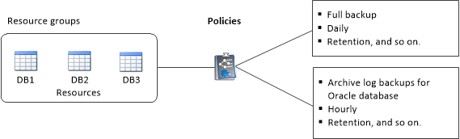

= Crea gruppi di risorse e allega policy per i file system Unix
:allow-uri-read: 
:icons: font
:imagesdir: ../media/

[role="lead"]
Un gruppo di risorse è un contenitore in cui aggiungere le risorse di cui si desidera eseguire il backup e la protezione.  Un gruppo di risorse consente di eseguire il backup di tutti i dati associati ai file system.

.Informazioni su questo compito
* Un database con file in gruppi di dischi ASM deve essere nello stato "MOUNT" o "OPEN" per verificare i propri backup utilizzando l'utilità Oracle DBVERIFY.
+
Allegare una o più policy al gruppo di risorse per definire il tipo di attività di protezione dei dati che si desidera eseguire.

+
L'immagine seguente illustra la relazione tra risorse, gruppi di risorse e criteri per i database:

+

* Per i criteri abilitati per SnapLock , per ONTAP 9.12.1 e versioni precedenti, se si specifica un periodo di blocco degli snapshot, i cloni creati dagli snapshot antimanomissione come parte del ripristino erediteranno il tempo di scadenza SnapLock . L'amministratore dell'archiviazione deve pulire manualmente i cloni dopo la scadenza SnapLock .
* L'aggiunta di nuovi file system senza SnapMirror ActiveSync a un gruppo di risorse esistente che contiene risorse con SnapMirror ActiveSync non è supportata.
* L'aggiunta di nuovi file system a un gruppo di risorse esistente in modalità failover di SnapMirror ActiveSync non è supportata.  È possibile aggiungere risorse al gruppo di risorse solo nello stato normale o di failback.

.Passi
. Nel riquadro di navigazione a sinistra, seleziona *Risorse* e il plug-in appropriato dall'elenco.
. Nella pagina Risorse, fare clic su *Nuovo gruppo di risorse*.
. Nella pagina Nome, eseguire le seguenti azioni:
+
.. Immettere un nome per il gruppo di risorse nel campo Nome.
+

NOTE: Il nome del gruppo di risorse non deve superare i 250 caratteri.

.. Inserisci una o più etichette nel campo Tag per aiutarti a cercare il gruppo di risorse in un secondo momento.
+
Ad esempio, se aggiungi HR come tag a più gruppi di risorse, potrai successivamente trovare tutti i gruppi di risorse associati al tag HR.

.. Selezionare la casella di controllo e immettere un formato di nome personalizzato che si desidera utilizzare per il nome dello snapshot.
+
Ad esempio, customtext_resource group_policy_hostname o resource group_hostname.  Per impostazione predefinita, al nome dello snapshot viene aggiunto un timestamp.

. Nella pagina Risorse, seleziona un nome host del file system Unix dall'elenco a discesa *Host*.
+

NOTE: Le risorse vengono elencate nella sezione Risorse disponibili solo se la risorsa viene rilevata correttamente.  Se hai aggiunto risorse di recente, queste appariranno nell'elenco delle risorse disponibili solo dopo aver aggiornato l'elenco delle risorse.

. Seleziona le risorse dalla sezione Risorse disponibili e spostale nella sezione Risorse selezionate.
. Nella pagina Impostazioni applicazione, procedere come segue:
+
** Selezionare la freccia Script e immettere i comandi pre e post per le operazioni di quiesce, snapshot e unquiesce.  È anche possibile immettere i comandi pre da eseguire prima di uscire in caso di errore.
** Selezionare una delle opzioni di coerenza del backup:
+
*** Selezionare *File System Consistent* se si desidera garantire che i dati memorizzati nella cache dei file system vengano svuotati prima di creare il backup e che non siano consentite operazioni di input o output sul file system durante la creazione del backup.
+

NOTE: Per la coerenza del file system, verranno acquisiti snapshot del gruppo di coerenza per i LUN coinvolti nel gruppo di volumi.

*** Selezionare *Crash Consistent* se si desidera garantire che i dati memorizzati nella cache dei file system vengano svuotati prima di creare il backup.
+

NOTE: Se hai aggiunto diversi file system nel gruppo di risorse, tutti i volumi provenienti da diversi file system nel gruppo di risorse verranno inseriti in un gruppo di coerenza.

. Nella pagina Criteri, procedere come segue:
+
.. Selezionare una o più policy dall'elenco a discesa.
+

NOTE: Puoi anche creare una policy cliccandoimage:../media/add_policy_from_resourcegroup.gif["aggiungi simbolo"] .

+
Nella sezione Configura pianificazioni per policy selezionate vengono elencate le policy selezionate.

.. Clicimage:../media/add_policy_from_resourcegroup.gif["aggiungi simbolo"] nella colonna Configura pianificazioni per il criterio per il quale si desidera configurare una pianificazione.
.. Nella finestra Aggiungi pianificazioni per il criterio _nome_criterio_, configura la pianificazione, quindi fai clic su *OK*.
+
Dove _policy_name_ è il nome della policy selezionata.

+
Le pianificazioni configurate sono elencate nella colonna Pianificazioni applicate.

+
Le pianificazioni di backup di terze parti non sono supportate quando si sovrappongono alle pianificazioni di backup SnapCenter .

. Nella pagina Notifica, dall'elenco a discesa *Preferenza e-mail*, seleziona gli scenari in cui desideri inviare le e-mail.
+
È necessario specificare anche gli indirizzi email del mittente e del destinatario, nonché l'oggetto dell'email.  Se si desidera allegare il report dell'operazione eseguita sul gruppo di risorse, selezionare *Allega report lavoro*.

+

NOTE: Per la notifica tramite e-mail, è necessario aver specificato i dettagli del server SMTP tramite l'interfaccia grafica utente (GUI) o il comando PowerShell Set-SmSmtpServer.

. Rivedi il riepilogo e poi clicca su *Fine*.

